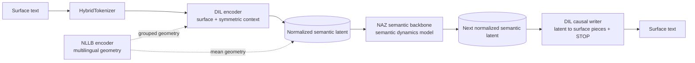

# Dilnaz

**Language:** English | [Türkçe](README.tr.md)


Dilnaz is a two-stage semantic language modeling research project. The first model, `DIL`, maps surface text into a normalized continuous semantic latent space and renders latents back into text. The second model, `NAZ`, learns autoregressive dynamics in that semantic space instead of predicting discrete token ids directly.

The working idea is:

```text
surface text -> DIL semantic latent -> NAZ next semantic latent -> DIL writer -> surface text
```

This is not a tokenizer-only project and it is not a wrapper around an external language model. The runtime tokenizer handles surface segmentation; the semantic learning target is the normalized DIL latent space shaped by reconstruction and NLLB teacher geometry.

## Architecture



The active pipeline has three practical stages:

1. Train `DIL` so surface pieces become semantic latents and can be written back.
2. Optionally fine-tune only the `DIL` writer from plain text while keeping the encoder contract fixed.
3. Train `NAZ` from a frozen `DIL` checkpoint so it predicts future semantic latents.

## DIL

`DIL` is the bridge between surface text and semantic space.

The encoder reads a fixed-width hybrid-tokenized target piece plus symmetric context:

```text
context_radius = 2
context_size = 2 * context_radius + 1
target_index = context_radius
```

The encoder output is normalized to a fixed-radius semantic latent:

```text
semantic_norm = sqrt(latent_size)
```

The current `DIL` model does not expose a learned post-fit semantic normalizer or a `mean/log_std` VAE distribution. The active contract is native normalized latents.

`DIL` has two coupled but separable jobs:

- encoder: surface/context -> normalized semantic latent
- writer: semantic latent -> causal hybrid surface-piece generation until STOP

Main training losses and metrics:

- NLLB grouped layer geometry loss
- NLLB mean geometry loss
- variance regularization
- writer token cross entropy
- byte accuracy, token exact match, stop accuracy

The writer path is deliberately fed with detached semantic latents during normal DIL training. That keeps surface-writing gradients from changing the semantic encoder path.

The writer does not emit raw UTF-8 bytes; it emits the tokenizer's existing hybrid surface piece ids. Training uses teacher forcing in one forward pass:

```text
decoder input = [BOS, piece_0, piece_1, ...]
label         = [piece_0, piece_1, ..., STOP]
```

`writer_stop_token_id` is part of the output vocabulary. `writer_bos_token_id` and `writer_empty_token_id` are input-only decoder tokens and are never emitted. Length is not predicted by a learned bucket/head; inference runs until STOP or the `max_surface_pieces_per_unit` safety limit. `surface_bucket_sizes` is only used for packed tensor memory layout.

## DIL Writer-Only Training

`python -m dilnaz.train.writer.train` loads an existing DIL checkpoint, freezes the encoder, and trains only the writer on plain text. This is used when surface rendering needs improvement without changing the semantic trunk.

The objective is:

```text
objective = causal_surface_writer_v1
loss = writer token cross entropy
```

This path uses the same checkpoint family as DIL:

```text
DIL checkpoint format_version = 26
```

## NAZ

`NAZ` is the semantic sequence model.

It does not predict token ids. It predicts the next normalized DIL latent, and can train multiple future horizons at once:

```text
z_t -> z_(t+1), z_(t+2), z_(t+3)
```

The active objective is:

```text
objective = semantic_dynamics_moe_mtp_v1
```

The prediction head is a semantic dynamics mixture head:

- multiple semantic candidates per horizon
- router logits over candidates
- mixture negative log likelihood
- router responsibility loss
- candidate usage balance
- selected-latent MSE and cosine metrics

The backbone is native Dilnaz code. It alternates cheap semantic mixing with periodic full attention:

```text
SemanticDeltaMixer
SemanticDeltaMixer
SemanticDeltaMixer
SemanticGlobalAttention
repeat...
```

Backbone components include:

- `ZeroCenteredRMSNorm`
- `PartialRotaryEmbedding`
- `SemanticDeltaMixer`
- `SemanticGlobalAttention`
- `SparseMoEFeedForward`
- `NazBackboneCache`

Generation is a semantic loop. The prompt is encoded by DIL once. After that, generated surface text is not fed back into the encoder:

```text
prompt surface -> DIL encoder -> prompt latents
NAZ -> next latent
NAZ -> next latent
DIL writer -> surface text
```

## Hybrid Tokenizer

Dilnaz owns its runtime tokenizer in `dilnaz/tokenization`.

The tokenizer provides:

- byte fallback
- compact surface pieces for common forms
- leading-space variants for boundary-aware decoding
- numeric, punctuation, common-word, contextual and character pieces
- packed variable-length surface tensors through `dilnaz.surface`
- roundtrip decoding tests for Turkish text, digits, punctuation and JSONL newline escapes

Default vocabulary:

```text
dilnaz/tokenization/hybrid_surface_vocab.json
```

The tokenizer is a surface contract. It does not decide semantic meaning. Semantic geometry comes from DIL training and NLLB teacher supervision.

## Data Formats

Text training files can be plain text or JSONL.

Plain text:

```text
Bir cumle.
Baska bir cumle.
```

JSONL:

```json
{"text": "Bir cumle."}
{"text": "Baska bir cumle."}
```

NAZ fine-tuning is handled by the unified `python -m dilnaz.train.naz.train --stage finetune` entrypoint.

`scripts/generate_math_sequence_data.py` can create math continuation and prompt/answer datasets.

## Training

Install dependencies from the project metadata or the training requirements, then run from the repository root. The examples below use PowerShell.

### 1. Train DIL

```powershell
cd D:\Projects\Dilnaz

python -m dilnaz.train.dil.train `
  --train-file .\TrainDatas\Test1.jsonl `
  --eval-file .\TrainDatas\TestCümleler.jsonl `
  --output-dir .\checkpoints\Dil `
  --data-mode streaming `
  --max-steps 30000 `
  --batch-size 64 `
  --eval-batch-size 64 `
  --log-every 50 `
  --eval-every 500 `
  --checkpoint-every 5000 `
  --compile-mode reduce-overhead `
  --bf16
```

Set `--compile-mode off` when the machine does not have a C compiler available for `torch.compile`.

### 2. Train Only The DIL Writer

```powershell
cd D:\Projects\Dilnaz

python -m dilnaz.train.writer.train `
  --train-file .\TrainDatas\Test1.jsonl `
  --eval-file .\TrainDatas\TestCümleler.jsonl `
  --checkpoint .\checkpoints\Dil\checkpoint.pt `
  --output-dir .\checkpoints\Dil `
  --data-mode streaming `
  --max-steps 30000 `
  --batch-size 64 `
  --eval-batch-size 64 `
  --log-every 50 `
  --eval-every 500 `
  --checkpoint-every 5000 `
  --compile-mode reduce-overhead `
  --bf16
```

### 3. Train NAZ

```powershell
cd D:\Projects\Dilnaz

python -m dilnaz.train.naz.train `
  --train-file .\TrainDatas\Test1.jsonl `
  --eval-file .\TrainDatas\TestCümleler.jsonl `
  --dil-checkpoint-dir .\checkpoints\Dil `
  --output-dir .\checkpoints\Naz `
  --data-mode streaming `
  --max-steps 30000 `
  --batch-size 8 `
  --eval-batch-size 8 `
  --sequence-length 258 `
  --log-every 50 `
  --eval-every 500 `
  --checkpoint-every 5000 `
  --compile-mode reduce-overhead `
  --bf16
```

`resident` mode pre-materializes/cache data for smaller experiments. `streaming` mode is the default and keeps the pipeline usable for larger files.

### One-Command Pipeline

```powershell
cd D:\Projects\Dilnaz

.\scripts\train_jsonl_pipeline.ps1 `
  -TrainFile .\TrainDatas\Test1.jsonl `
  -EvalFile .\TrainDatas\TestCümleler.jsonl `
  -DataMode streaming `
  -CompileMode reduce-overhead `
  -Bf16
```

The pipeline runs DIL semantic training, DIL writer-only training, and NAZ training in order.

## Inference And Inspection

### Inspect DIL

```powershell
cd D:\Projects\Dilnaz

python -m dilnaz.train.interface.interface_dil `
  --checkpoint-dir .\checkpoints\Dil `
  --text "Disi aslanin disi kirildi."
```

This prints tokenizer pieces, DIL semantic similarity, NLLB teacher similarity, decoded writer output, and an automatic latent swap probe.

### Generate With NAZ

```powershell
cd D:\Projects\Dilnaz

python -m dilnaz.train.interface.interface_naz `
  --checkpoint-dir .\checkpoints\Naz `
  --text "15 + 4241 =" `
  --max-new-tokens 8 `
  --writer-microbatch-size 8 `
  --compile-mode off
```

The NAZ interface streams generated surface text by batching pending semantic latents through the DIL writer. It stops when the writer emits STOP or when semantic repetition crosses the configured threshold after `min_new_tokens`.

## Checkpoint Contracts

Current checkpoint families:

```text
DIL format_version = 26
NAZ format_version = 26
NAZ objective = semantic_dynamics_moe_mtp_v1
DIL writer-only objective = causal_surface_writer_v1
semantic_space = dil_normalized_latent
```

Backward checkpoint compatibility is intentionally not maintained while the architecture is moving. Old checkpoint families are rejected instead of silently converted.

## Compile Strategy

Compile is optional and controlled by `--compile-mode`:

```text
off
default
reduce-overhead
max-autotune
```

Default behavior:

- CUDA: `reduce-overhead`
- CPU: `off`

Only pure tensor forwards are compiled:

- `DilEncoderCore.forward`
- `DilConditionalWriter.forward`
- `NazStudentCore` / semantic backbone path

Tokenization, checkpointing, cache setup, random state handling and log bookkeeping remain outside the compiled graph.

## Repository Layout

```text
dilnaz/
  models/
    common/
    dil/
    naz/
  tokenization/
    hybrid_tokenizer.py
    hybrid_surface_vocab.json
  train/
    common/
      runtime.py
      trainer_core.py
    configs/
      defaults.py
    data/
      dil_data.py
      naz_data.py
      parallel_dil_data.py
    dil/
      train.py
      train_parallel.py
      train_teacherless_parallel.py
    writer/
      train.py
    naz/
      train.py
    interface/
      interface_dil.py
      interface_naz.py
      writer_buffer.py
scripts/
  train_jsonl_pipeline.ps1
  generate_math_sequence_data.py
  naz_attention_benchmark.py
tests/
```

## Validation

Focused local validation for the active DIL/NAZ surface:

```powershell
cd D:\Projects\Dilnaz

python -m pytest -q tests\test_dil_modeling.py tests\test_hybrid_tokenizer.py tests\test_parallel_dil_training.py tests\test_parallel_tr_en_encoder_aligner.py
```

At the time of this README update, the focused suite above passes. The full `pytest` suite can be blocked by `tests/test_subword_merge.py` because it imports a sibling `DataCreator` symbol that may not exist in the current local checkout.

## Development Principles

- No backward compatibility layers for stale architecture.
- Keep semantic learning separate from surface writing.
- Keep DIL and NAZ responsibilities separate.
- Do not feed generated surface text back into NAZ during generation.
- Validate tensor contracts with tests before treating a checkpoint as usable.
- Prefer explicit checkpoint/objective rejection over hidden fallback behavior.

## Status

Dilnaz is an experimental research codebase. The current focus is:

- stronger DIL semantic geometry and writer reconstruction
- stable NAZ semantic dynamics over longer contexts
- prompt/answer fine-tuning on semantic targets
- multilingual semantic alignment experiments
- practical generation interfaces that match the training contract
