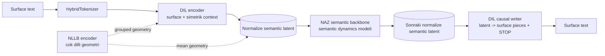

# Dilnaz

**Dil:** [English](README.md) | Türkçe


Dilnaz iki aşamalı bir semantic language modeling araştırma projesidir. İlk model olan `DIL`, yüzey metni normalize edilmiş continuous semantic latent uzaya taşır ve latentleri tekrar metne yazar. İkinci model olan `NAZ`, discrete token id tahmin etmek yerine bu semantic uzayda autoregressive dinamikleri öğrenir.

Aktif fikir:

```text
yüzey metni -> DIL semantic latent -> NAZ sonraki semantic latent -> DIL writer -> yüzey metni
```

Bu proje yalnızca tokenizer projesi değildir ve dışarıdan bir language model backbone wrapper'ı da değildir. Runtime tokenizer yüzey segmentasyonunu yapar; semantic hedef ise reconstruction ve NLLB teacher geometry ile şekillenen normalize DIL latent uzayıdır.

## Mimari



Aktif pipeline üç pratik aşamadan oluşur:

1. `DIL` eğitilir; yüzey parçaları semantic latente dönüşür ve tekrar yazılabilir hale gelir.
2. Gerekirse sadece `DIL` writer plain text ile fine-tune edilir; encoder contract sabit kalır.
3. `NAZ`, frozen `DIL` checkpointinden üretilen semantic latentler ile eğitilir.

## DIL

`DIL`, yüzey metni ile semantic uzay arasındaki köprüdür.

Encoder fixed-width hybrid-tokenized target parçasını ve simetrik context'i okur:

```text
context_radius = 2
context_size = 2 * context_radius + 1
target_index = context_radius
```

Encoder çıktısı sabit yarıçaplı semantic latente normalize edilir:

```text
semantic_norm = sqrt(latent_size)
```

Güncel `DIL` modeli learned post-fit semantic normalizer veya `mean/log_std` VAE dağılımı sunmaz. Aktif contract native normalize latenttir.

`DIL` iki işi birbirinden ayırarak yapar:

- encoder: surface/context -> normalize semantic latent
- writer: semantic latent -> STOP'a kadar causal hybrid surface-piece üretimi

Ana loss ve metricler:

- NLLB grouped layer geometry loss
- NLLB mean geometry loss
- variance regularization
- writer token cross entropy
- byte accuracy, token exact match, stop accuracy

Normal DIL eğitiminde writer detached semantic latent ile beslenir. Bu sayede yüzey yazma gradientleri semantic encoder trunk'ını bozmaz.

Writer raw UTF-8 byte üretmez; tokenizer'ın mevcut hybrid surface parça ID'lerini üretir. Eğitim kontratı teacher forcing ile tek forward'dır:

```text
decoder input = [BOS, piece_0, piece_1, ...]
label         = [piece_0, piece_1, ..., STOP]
```

`writer_stop_token_id` output vocab içindedir. `writer_bos_token_id` ve `writer_empty_token_id` sadece decoder input tarafında kullanılır, output olarak üretilmez. Uzunluk learned bucket/head ile tahmin edilmez; inference STOP gelene kadar veya `max_surface_pieces_per_unit` güvenlik limitine kadar ilerler. `surface_bucket_sizes` yalnızca packed tensor memory layout seçimi için kullanılır.

Global metin sonu ile Writer unit sonu ayrı tutulur:

- `tokenizer.eos_token_id`: gerçek document/text EOS unit'idir. NAZ bu semantic unit'i tahmin ettiğinde Writer ilk surface parça olarak bu tokenı üretir ve interface tüm metin üretimini durdurur.
- `writer_stop_token_id`: sadece mevcut surface unit'in causal yazımı bitti anlamına gelir. Decode edilen metne yazılmaz.

DIL/Writer ve NAZ eğitim datası aynı global EOS kontratını paylaşır. Her JSONL/text record sonuna tokenizer EOS unit'i eklenir; EOS unit'i Writer hedefi olarak öğretilir, ancak NLLB teacher geometry distillation'a dahil edilmez.

## DIL Writer-Only Eğitimi

`python -m dilnaz.train.writer.train` mevcut DIL checkpointini yükler, encoder'ı freeze eder ve yalnızca writer'ı plain text üzerinde eğitir. Amaç surface rendering kalitesini artırırken semantic trunk'ı değiştirmemektir.

Objective:

```text
objective = causal_surface_writer_v1
loss = writer token cross entropy
```

Bu yol aynı DIL checkpoint ailesini kullanır:

```text
DIL checkpoint format_version = 27
```

## Sonraki Writer Denemesi: Buffer-Level Surface Refiner

Mevcut ana Writer kontratı causal kalır. Sonraki deney fikri, bu Writer'ın yerine diffusion koymak değil; causal Writer'ın ürettiği taslak surface çıktısını `SlidingWriterBuffer` window'u üzerinde ikinci bir katmanla düzeltmektir.

Amaç:

- NAZ'ın ürettiği semantic latentleri yine önce causal Writer ile yazıya dökmek.
- STOP ve surface uzunluğunu causal Writer'a bırakmak.
- Buffer içindeki `[left context] [active] [right guard]` semantic window'u ve causal draft surface grid'ini birlikte kullanarak active bölgenin yüzey hatalarını düzeltmek.
- Özellikle boşluk, ek, noktalama, boundary ve çok parçalı yüzey kararlarını window seviyesinde iyileştirmek.
- Eski bucket/head, commit score veya learned length prediction karmaşasını geri getirmemek.

Önerilen araştırma kontratı:

```text
NAZ semantic window
-> causal Writer draft: token_ids + token_mask + STOP length
-> optional SurfaceRefiner/DiffusionRefiner
-> active surface commit
```

İlk denemede refiner uzunluk değiştirmez. `token_mask` causal Writer'dan gelir; refiner sadece mevcut mask içindeki hybrid surface parça ID'lerini düzeltir. Right guard, commit sınırı olmaya devam eder. Böylece diffusion fikri tek kelimenin içine değil, buffer'daki çoklu semantic unit surface alanına uygulanır.

## NAZ

`NAZ`, semantic sequence modelidir.

Token id tahmin etmez. Bir sonraki normalize DIL latentini tahmin eder ve aynı anda birden fazla gelecek horizon eğitebilir:

```text
z_t -> z_(t+1), z_(t+2), z_(t+3)
```

Aktif objective:

```text
objective = semantic_dynamics_moe_mtp_v1
```

Prediction head semantic dynamics mixture head'dir:

- horizon başına birden fazla semantic candidate
- candidate router logits
- mixture negative log likelihood
- router responsibility loss
- candidate usage balance
- selected-latent MSE ve cosine metricleri

Backbone tamamen Dilnaz'a ait native koddur. Ucuz semantic mixing ile periyodik full attention birlikte kullanılır:

```text
SemanticDeltaMixer
SemanticDeltaMixer
SemanticDeltaMixer
SemanticGlobalAttention
tekrar...
```

Backbone bileşenleri:

- `ZeroCenteredRMSNorm`
- `PartialRotaryEmbedding`
- `SemanticDeltaMixer`
- `SemanticGlobalAttention`
- `SparseMoEFeedForward`
- `NazBackboneCache`

Generation semantic-loop şeklindedir. Prompt DIL ile bir kez encode edilir. Sonrasında generated surface text encoder'a geri sokulmaz:

```text
prompt surface -> DIL encoder -> prompt latentleri
NAZ -> sonraki latent
NAZ -> sonraki latent
DIL writer -> surface text
```

## Hybrid Tokenizer

Dilnaz runtime tokenizer'ını `dilnaz/tokenization` altında kendisi taşır.

Tokenizer şunları sağlar:

- byte fallback
- sık yüzey biçimleri için compact surface pieces
- boundary-aware decoding için leading-space varyantları
- numeric, punctuation, common-word, contextual ve character parçaları
- `dilnaz.surface` üzerinden packed variable-length surface tensorları
- Türkçe metin, digit, punctuation ve JSONL newline escape roundtrip testleri

Varsayılan vocabulary:

```text
dilnaz/tokenization/hybrid_surface_vocab.json
```

Tokenizer surface contract'tır. Semantic anlamı belirlemez. Semantic geometri DIL eğitimi ve NLLB teacher supervision ile öğrenilir.

## Veri Formatları

Text eğitim dosyaları plain text veya JSONL olabilir.

Plain text:

```text
Bir cumle.
Baska bir cumle.
```

JSONL:

```json
{"text": "Bir cumle."}
{"text": "Baska bir cumle."}
```

NAZ fine-tuning tek girişten çalışır: `python -m dilnaz.train.naz.train --stage finetune`.

`scripts/generate_math_sequence_data.py` math continuation ve prompt/answer datasetleri üretebilir.

## Eğitim

Dependency'leri project metadata'dan veya training requirements dosyasından kurduktan sonra repo root'tan çalıştır. Aşağıdaki örnekler PowerShell içindir.

### 1. DIL Eğitimi

```powershell
cd D:\Projects\Dilnaz

python -m dilnaz.train.dil.train `
  --train-file .\TrainDatas\Test1.jsonl `
  --eval-file .\TrainDatas\TestCümleler.jsonl `
  --output-dir .\checkpoints\Dil `
  --data-mode streaming `
  --max-steps 30000 `
  --batch-size 64 `
  --eval-batch-size 64 `
  --log-every 50 `
  --eval-every 500 `
  --checkpoint-every 5000 `
  --compile-mode reduce-overhead `
  --bf16
```

Makinede `torch.compile` için C compiler yoksa `--compile-mode off` kullan.

### 2. Sadece DIL Writer Eğitimi

```powershell
cd D:\Projects\Dilnaz

python -m dilnaz.train.writer.train `
  --train-file .\TrainDatas\Test1.jsonl `
  --eval-file .\TrainDatas\TestCümleler.jsonl `
  --checkpoint .\checkpoints\Dil\checkpoint.pt `
  --output-dir .\checkpoints\Dil `
  --data-mode streaming `
  --max-steps 30000 `
  --batch-size 64 `
  --eval-batch-size 64 `
  --log-every 50 `
  --eval-every 500 `
  --checkpoint-every 5000 `
  --compile-mode reduce-overhead `
  --bf16
```

### 3. NAZ Eğitimi

```powershell
cd D:\Projects\Dilnaz

python -m dilnaz.train.naz.train `
  --train-file .\TrainDatas\Test1.jsonl `
  --eval-file .\TrainDatas\TestCümleler.jsonl `
  --dil-checkpoint-dir .\checkpoints\Dil `
  --output-dir .\checkpoints\Naz `
  --data-mode streaming `
  --max-steps 30000 `
  --batch-size 8 `
  --eval-batch-size 8 `
  --sequence-length 258 `
  --log-every 50 `
  --eval-every 500 `
  --checkpoint-every 5000 `
  --compile-mode reduce-overhead `
  --bf16
```

`resident` mode küçük deneylerde datayı/cache'i başta hazırlar. `streaming` varsayılandır ve büyük dosyalar için daha uygundur.

### Tek Komut Pipeline

```powershell
cd D:\Projects\Dilnaz

.\scripts\train_jsonl_pipeline.ps1 `
  -TrainFile .\TrainDatas\Test1.jsonl `
  -EvalFile .\TrainDatas\TestCümleler.jsonl `
  -DataMode streaming `
  -CompileMode reduce-overhead `
  -Bf16
```

Pipeline sırayla DIL semantic training, DIL writer-only training ve NAZ training çalıştırır.

## Inference ve İnceleme

### DIL İnceleme

```powershell
cd D:\Projects\Dilnaz

python -m dilnaz.train.interface.interface_dil `
  --checkpoint-dir .\checkpoints\Dil `
  --text "Dişi aslanın dişi kırıldı."
```

Bu araç tokenizer parçalarını, DIL semantic similarity çıktısını, NLLB teacher similarity çıktısını, writer decode sonucunu ve otomatik latent swap probe'unu basar.

### NAZ Üretim

```powershell
cd D:\Projects\Dilnaz

python -m dilnaz.train.interface.interface_naz `
  --checkpoint-dir .\checkpoints\Naz `
  --text "15 + 4241 =" `
  --max-new-tokens 8 `
  --writer-microbatch-size 8 `
  --compile-mode off
```

NAZ interface'i pending semantic latentleri DIL writer'dan batch halinde geçirerek generated surface text'i stream eder. Writer STOP ürettiğinde veya `min_new_tokens` sonrası semantic repetition threshold aşılırsa durur.

## Checkpoint Kontratları

Güncel checkpoint aileleri:

```text
DIL format_version = 27
NAZ format_version = 27
NAZ objective = semantic_dynamics_moe_mtp_v1
DIL writer-only objective = causal_surface_writer_v1
semantic_space = dil_normalized_latent
```

Mimari aktif olarak değiştiği için geriye dönük checkpoint uyumluluğu taşınmaz. Eski checkpoint aileleri sessiz dönüştürülmez, doğrudan reddedilir.

## Compile Stratejisi

Compile opsiyoneldir ve `--compile-mode` ile kontrol edilir:

```text
off
default
reduce-overhead
max-autotune
```

Varsayılan davranış:

- CUDA: `reduce-overhead`
- CPU: `off`

Sadece saf tensor forwardları compile edilir:

- `DilEncoderCore.forward`
- `DilConditionalWriter.forward`
- `NazStudentCore` / semantic backbone path

Tokenization, checkpointing, cache setup, random state handling ve log bookkeeping compile grafiğinin dışında kalır.

## Proje Yapısı

```text
dilnaz/
  models/
    common/
    dil/
    naz/
  tokenization/
    hybrid_tokenizer.py
    hybrid_surface_vocab.json
  train/
    common/
      runtime.py
      trainer_core.py
    configs/
      defaults.py
    data/
      dil_data.py
      naz_data.py
      parallel_dil_data.py
    dil/
      train.py
      train_parallel.py
      train_teacherless_parallel.py
    writer/
      train.py
    naz/
      train.py
    interface/
      interface_dil.py
      interface_naz.py
      writer_buffer.py
scripts/
  train_jsonl_pipeline.ps1
  generate_math_sequence_data.py
  naz_attention_benchmark.py
tests/
```

## Doğrulama

Aktif DIL/NAZ yüzeyi için odaklı lokal doğrulama:

```powershell
cd D:\Projects\Dilnaz

python -m pytest -q tests\test_dil_modeling.py tests\test_hybrid_tokenizer.py tests\test_parallel_dil_training.py tests\test_parallel_tr_en_encoder_aligner.py
```

Bu README güncellemesi sırasında yukarıdaki odaklı suite geçiyor. Full `pytest` şu an `tests/test_subword_merge.py` yüzünden bloklanabilir; çünkü sibling `DataCreator` checkout'unda mevcut olmayabilecek bir sembol import ediyor.

## Geliştirme İlkeleri

- Eski mimari için backward compatibility layer taşınmaz.
- Semantic öğrenme surface writing'den ayrı tutulur.
- DIL ve NAZ sorumlulukları ayrı kalır.
- Generation sırasında generated surface text NAZ'a geri encode edilmez.
- Checkpoint kullanılabilir sayılmadan önce tensor contract testleri doğrulanır.
- Gizli fallback yerine explicit checkpoint/objective rejection tercih edilir.

## Durum

Dilnaz deneysel bir araştırma kod tabanıdır. Güncel odak:

- daha güçlü DIL semantic geometry ve writer reconstruction
- uzun contextte daha stabil NAZ semantic dynamics
- semantic targetlar üzerinde prompt/answer fine-tuning
- multilingual semantic alignment deneyleri
- eğitim contract'ı ile eşleşen pratik generation interface'leri
